#HSLIDE

#HSLIDE

## The Evolution of the XDA Community

#HSLIDE
## In the beginning...

- Began in Amsterdam Late 2003
- Group of friends wanting to modify these "XDA" devices from O2 <!-- .element: class="fragment" -->
- Have undergone many a facelift over the years <!-- .element: class="fragment" -->

#VSLIDE
### 2003 - 3000 users

#VSLIDE
### 2004 - 9979 users

#VSLIDE
### 2005 - 42455 users
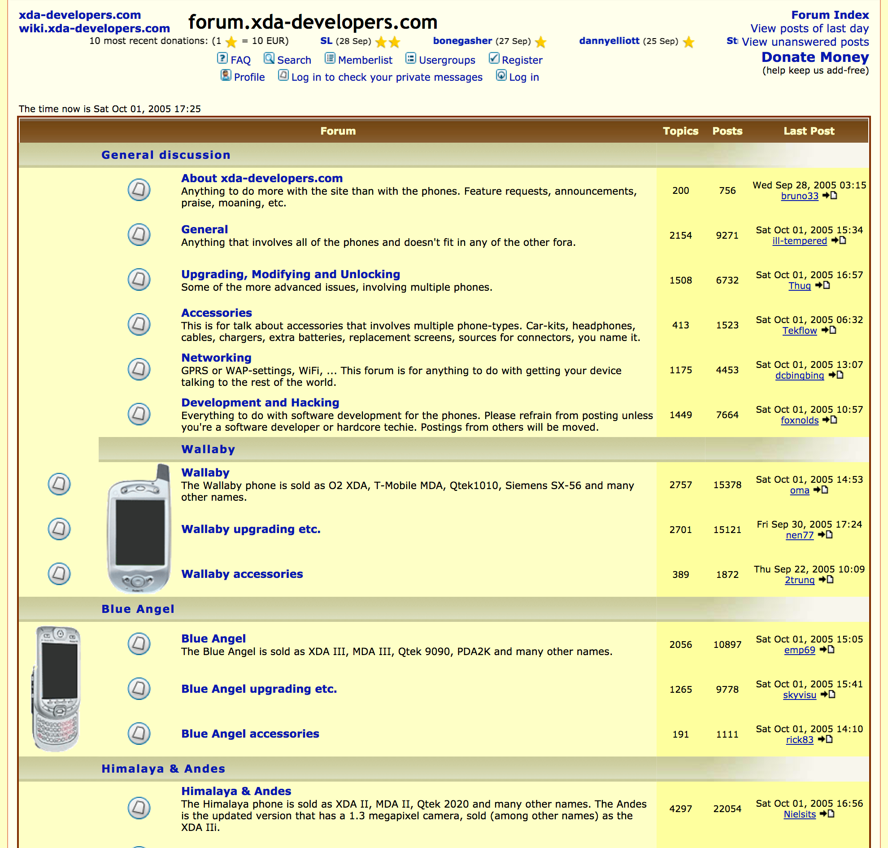

#VSLIDE
## Exponential Growth
- 2006 - 162644 users
- 2007 - 519813 users <!-- .element: class="fragment" -->
- 2008 - 1.2mil users (Android arrives on XDA) <!-- .element: class="fragment" -->
- 2009 - 2mil users <!-- .element: class="fragment" -->
- 2010 - Look updated, 3mil users <!-- .element: class="fragment" -->
- 2011 - 4.2mil users <!-- .element: class="fragment" -->

#VSLIDE
### 2012-13
#### Modern Look / 4.8mil => 5.4mil users

#VSLIDE
### 2014-15
#### Integrated Portal / 6mil => 6.9mil users

#VSLIDE
### 2016-17
#### Streamlined Look / 7.9mil users
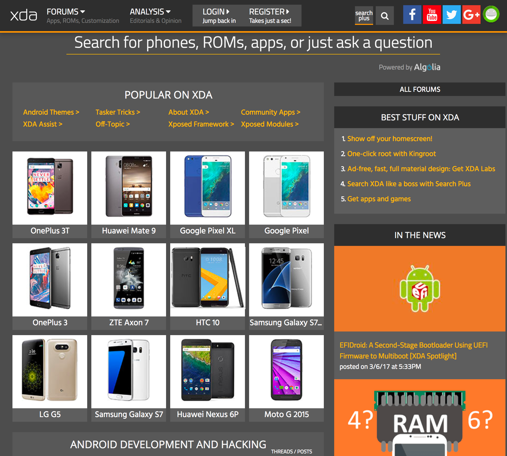

#VSLIDE
### India 2nd Largest Base of users
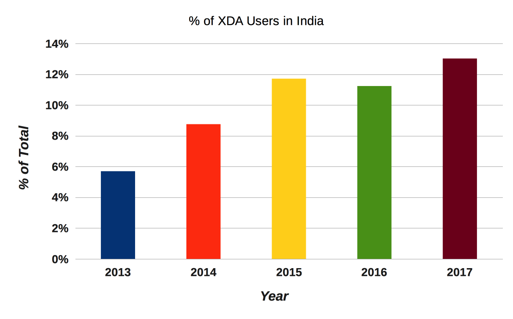

#HSLIDE
## What's Next for XDA?
### XDA Labs
- By the team at XDA
- Building a new platform for distribution of apps <!-- .element: class="fragment" -->
- Community-first, by devs for the community <!-- .element: class="fragment" -->
- Devs deserve another choice <!-- .element: class="fragment" -->

#VSLIDE
## What is XDA Labs?
- The best way to browse the XDA forums on mobile - ad-free and fast
- Access news articles from the XDA Portal directly the app <!-- .element: class="fragment" -->
- The fastest way to get stable/beta/alpha builds of your favorite apps. <!-- .element: class="fragment" -->
- The most developer- and community-centric way to distribute your apps. <!-- .element: class="fragment" -->

#VSLIDE
## Accessing the XDA Forums
- Access the XDA Forum via our own API, designed for speed  
- Built entirely in-house giving us full control over every aspect of its feature set and functionality <!-- .element: class="fragment" -->

#VSLIDE
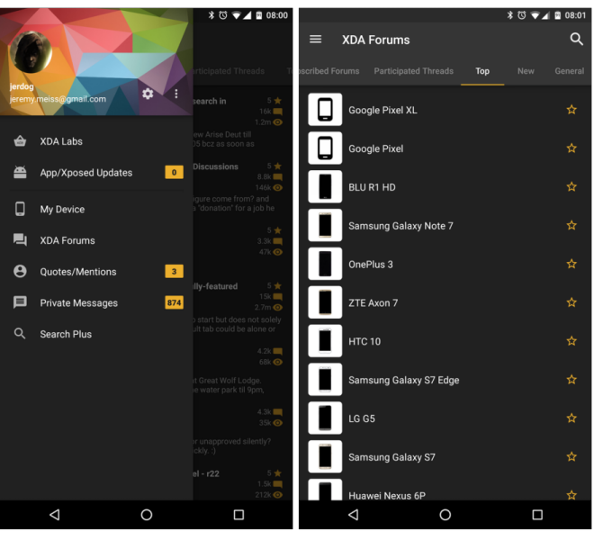

#VSLIDE
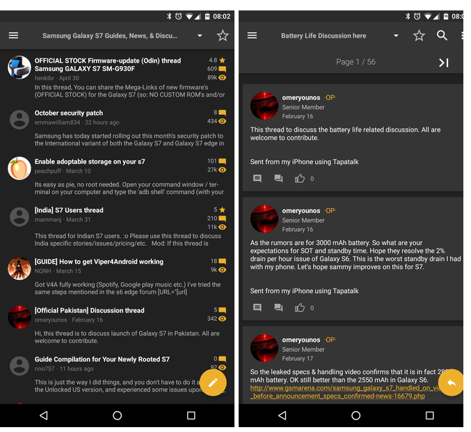

#VSLIDE
### For Your Device
- Better integration with the device you're accessing XDA on via My Device
- Automatically detects your device and displays the most popular threads and direct links to the full device forum<!-- .element: class="fragment" -->

#VSLIDE
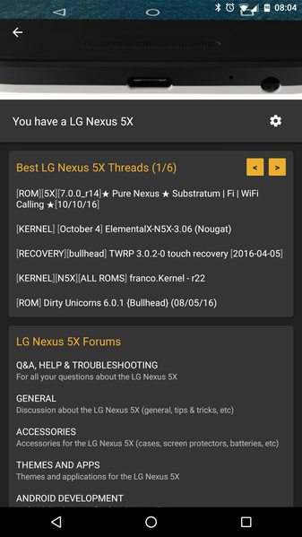

#HSLIDE
## Apps / Xposed Mods / Wallpapers

#VSLIDE
### Stats:
- 400+ apps  <!-- .element: class="fragment" -->
- 1000+ Xposed modules <!-- .element: class="fragment" -->
- 6500+ Labs Developer accounts <!-- .element: class="fragment" -->
- 250k+ Labs users <!-- .element: class="fragment" -->
  - Averaging 1500+ new users per day <!-- .element: class="fragment" -->
  - 1+ million sessions per month <!-- .element: class="fragment" -->

#VSLIDE
### More Stats:
- Translated into 30 languages <!-- .element: class="fragment" -->
- Active users doubled in the past 2 months <!-- .element: class="fragment" -->
- Active users loading the app 4-5 times per day <!-- .element: class="fragment" -->
- User makeup is truly international <!-- .element: class="fragment" -->
  - 30% Asia <!-- .element: class="fragment" -->
  - 28% North America <!-- .element: class="fragment" -->
  - 27% Europe <!-- .element: class="fragment" -->
  - 15% Mars <!-- .element: class="fragment" -->

#VSLIDE
### Key Features
- No ads
- App distribution platform for hobbiest and professional developers <!-- .element: class="fragment" -->
- Not a replacement for Play - can co-exist <!-- .element: class="fragment" -->
- Support for Alpha, Beta, and Stable release channels <!-- .element: class="fragment" -->

#VSLIDE
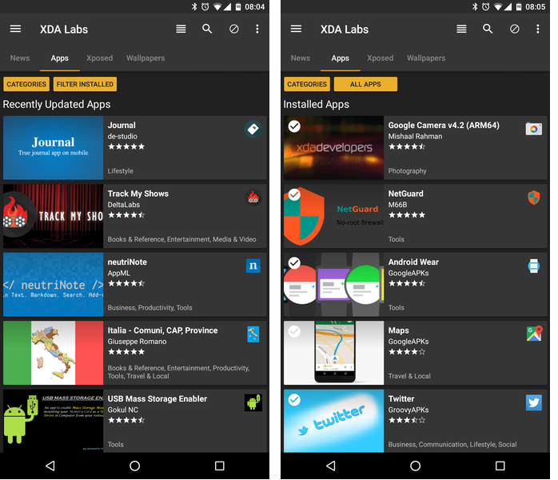

#VSLIDE
### Key Features
- Built-in forum integration on XDA, allowing for interactive communication with users
- Built-in commerce for devs where developers get 100% of app revenue (Play gives 70% before taxes) <!-- .element: class="fragment" -->
  - Accept purchases via Paypal or Bitcoin <!-- .element: class="fragment" -->

#VSLIDE
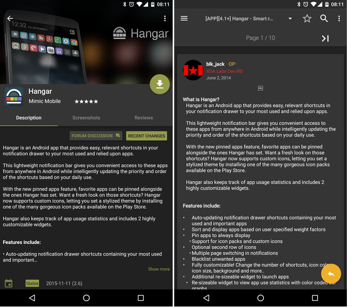

#VSLIDE
### Xposed Integration
- Xposed is an innovative framework for rooted devices, allowing users to modify the system without a custom ROM
- All Xposed modules are at your fingertips  <!-- .element: class="fragment" -->

#VSLIDE
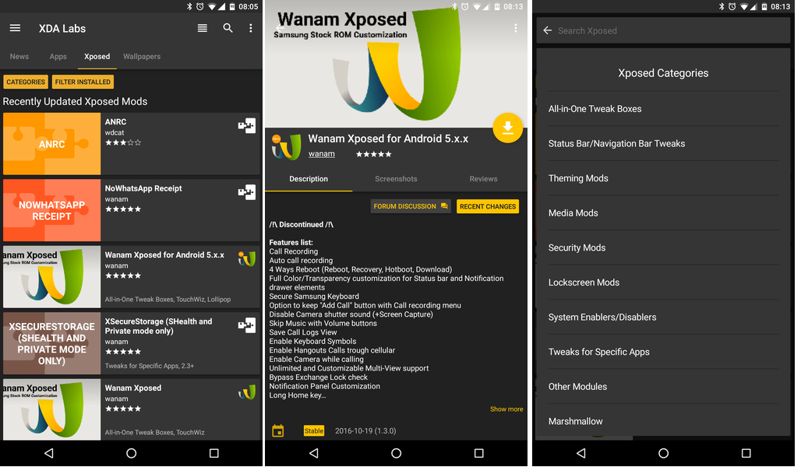

#VSLIDE
### Other Goodies
- Wallpaper download and install

#VSLIDE
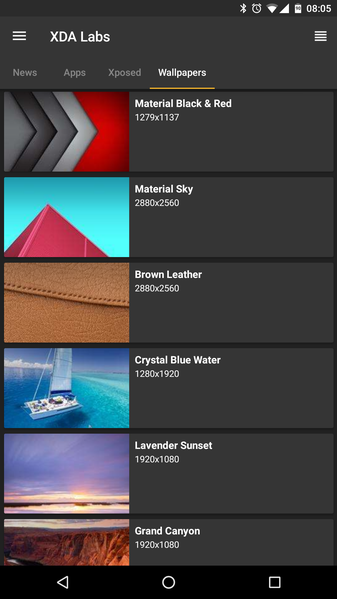

#VSLIDE
### Other Goodies
- Wallpaper download and install
- Receive notification of updates to any app on your device, if it's in Labs, regardless of distribution platform used (Play, Amazon, etc.)

#HSLIDE
## Why Labs?
- Bootstrapping on XDA's established reputation in the community
- More technical than average audience <!-- .element: class="fragment" -->
- Good proving ground for your app <!-- .element: class="fragment" -->
- Don't worry about Google killing your developer account! <!-- .element: class="fragment" -->
- Innovate freely, and build cool things <!-- .element: class="fragment" -->

#VSLIDE
### Pro-Developer
- We allow all types of apps (including stuff not allowed on Play)
- We don't remove apps without warning and without communication to the developer <!-- .element: class="fragment" -->
- We enable developers to sell apps, receiving 100% of the proceeds directly <!-- .element: class="fragment" -->
- If you have an issue, there's a real person to work with, not an algorhithm or robot <!-- .element: class="fragment" -->

#VSLIDE
## Easy to Add
- Not complicated
- Quick submission process (3 steps, 4 if your app is for sale) <!-- .element: class="fragment" -->
- No need to follow 10 steps to make sure you don't get kicked out <!-- .element: class="fragment" -->

#VSLIDE
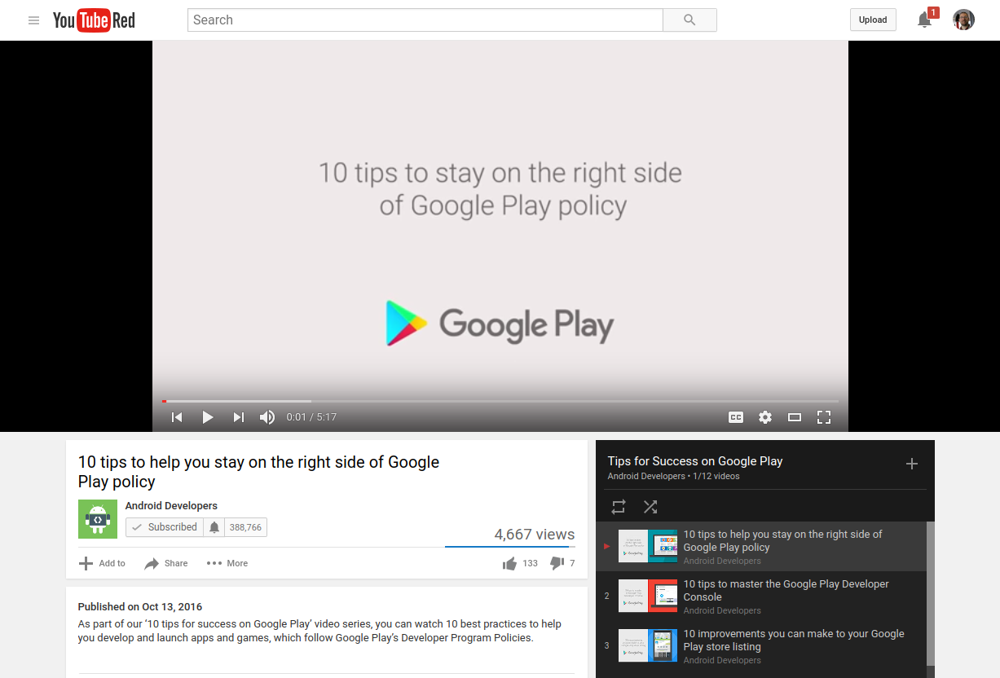

#HSLIDE
## Get XDA Labs

#HSLIDE
## Questions
