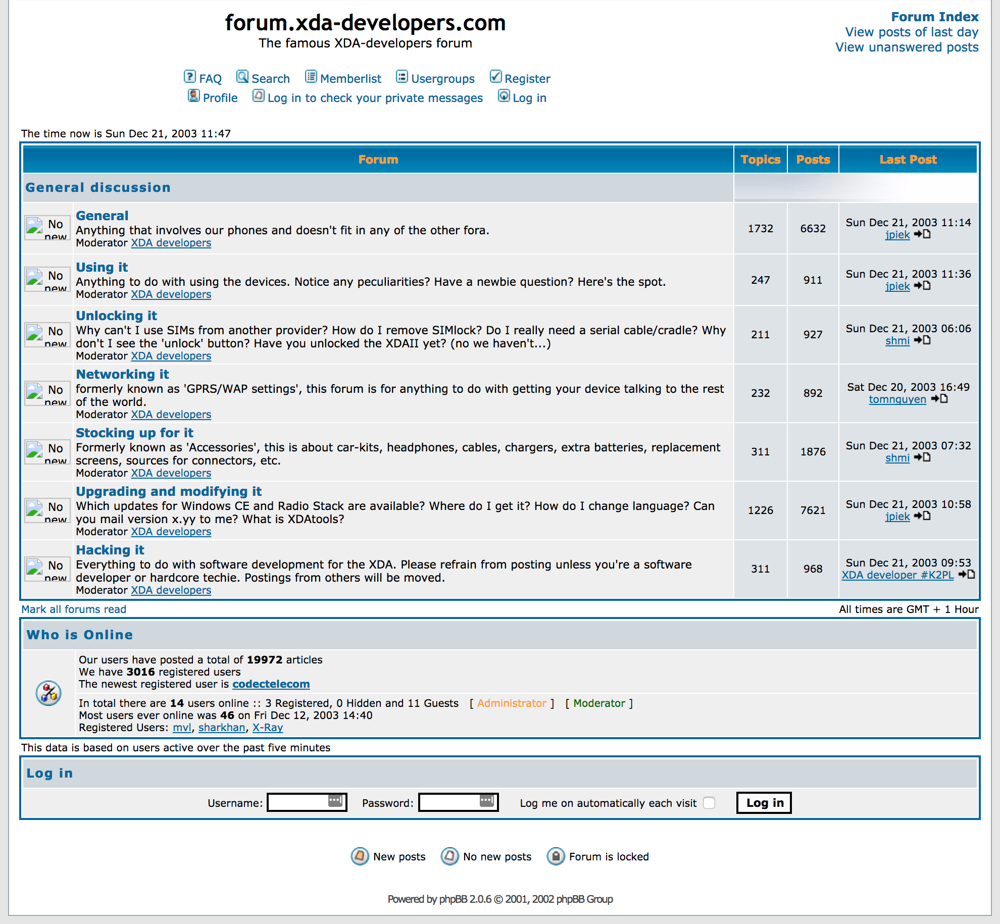
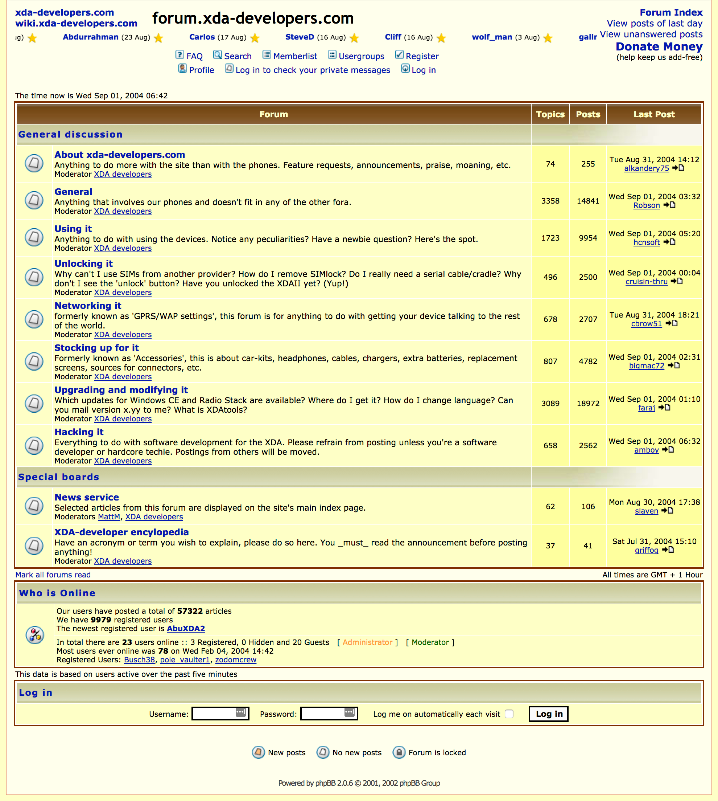
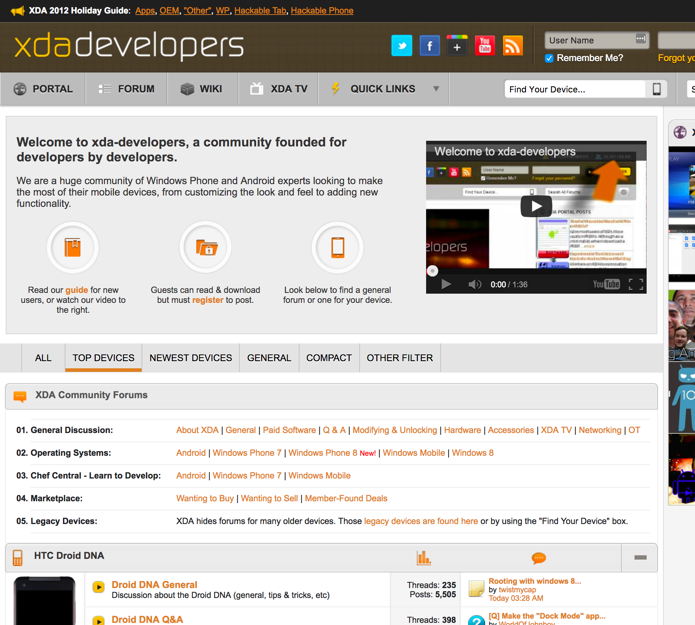
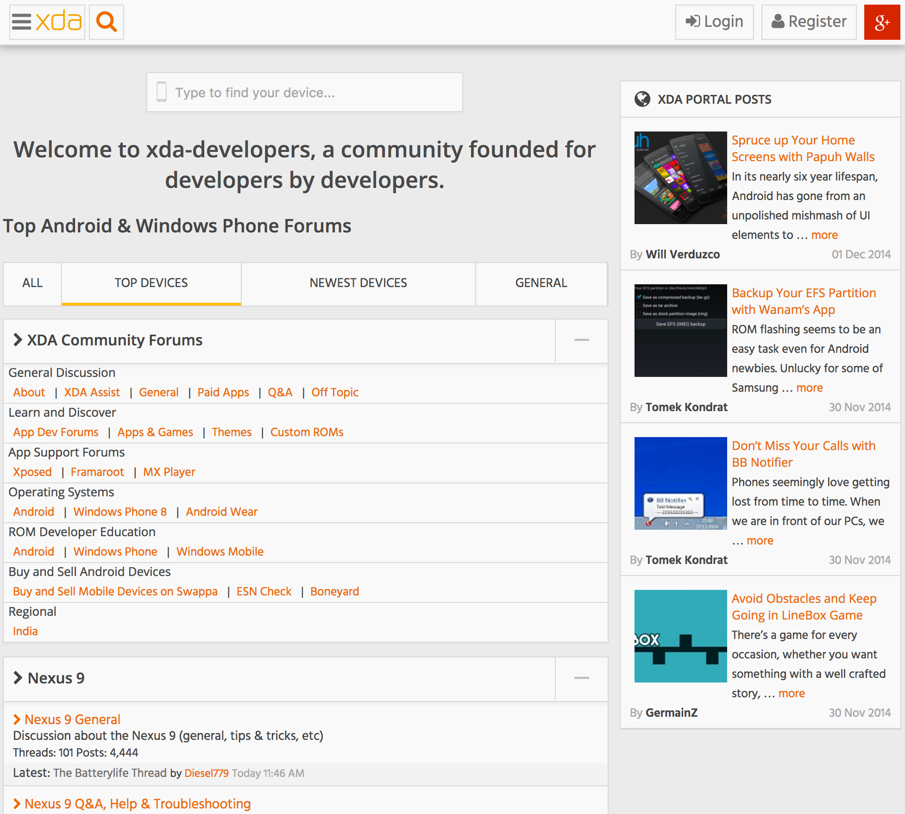

#HSLIDE

#HSLIDE

## The Evolution of the XDA Community

#HSLIDE
## In the beginning...

- Began in Amsterdam Late 2003
- Group of friends wanting to modify these "XDA" devices from O2
- Have undergone many a facelift over the years

#VSLIDE
## 2003 - 3000 users

#VSLIDE
## 2004 - 9979 users

#VSLIDE
## 2005 - 42455 users

##VSLIDE?image=assets/xda_forum_2005.png

#VSLIDE
## Exponential Growth
- 2006 - 162644 users
- 2007 - 519813 users
- 2008 - 1.2mil users (Android arrives on XDA)
- 2009 - 2mil users
- 2010 - Look updated, 3mil users
- 2011 - 4.2mil users

#VSLIDE
## 2012-13 - Modern Look / 4.8mil => 5.4mil users

#VSLIDE
## 2014-15 - Integrated Portal / 6mil => 6.9mil users

#VSLIDE
## 2016-17 - Streamlined Look / 7.9mil users

#HSLIDE
## Questions
